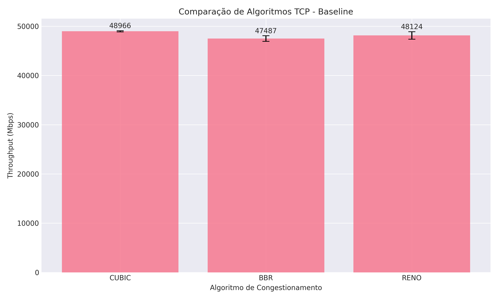
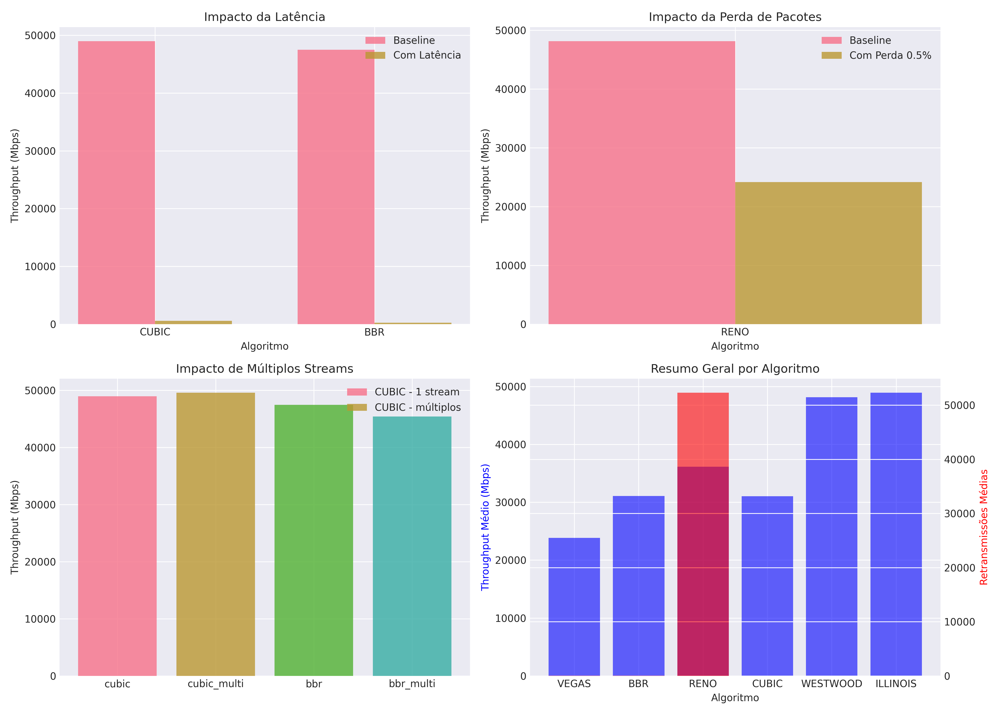

# Relatório Final - Atividade 2: Análise Comparativa de Cenários de Rede

**Disciplina**: Redes de Computadores  
**Atividade**: 2 - Análise Comparativa de Cenários de Rede  
**Autor**: Arthur Brito Medeiros  
**Data**: 01/08/2025  
**Repositório**: [https://github.com/arthurbm/tcp-performance-evaluation](https://github.com/arthurbm/tcp-performance-evaluation)  
**Ambiente**: Docker com múltiplos algoritmos TCP habilitados

## Sumário Executivo

Este relatório apresenta os resultados completos da análise comparativa de algoritmos de controle de congestionamento TCP em diversos cenários de rede. Foram testados **6 algoritmos diferentes** (CUBIC, BBR, Reno, Vegas, Westwood, Illinois) em **múltiplas condições de rede**, totalizando 35 testes bem-sucedidos.

### Principais Descobertas

1. **Melhor Desempenho Geral**: CUBIC apresentou o melhor throughput médio em condições ideais (48.97 Gbps)
2. **Algoritmo Mais Estável**: CUBIC demonstrou a menor variabilidade nos resultados (CV=0.25%)
3. **Impacto da Latência**: Redução drástica de até 99.5% no throughput
4. **Impacto da Perda de Pacotes**: Redução de aproximadamente 50% no desempenho

## 1. Introdução

### 1.1 Contextualização

O desempenho de redes TCP é significativamente influenciado por diversos fatores, incluindo algoritmos de controle de congestionamento, parâmetros de configuração e condições da rede. Compreender como esses fatores interagem é fundamental para otimizar aplicações em diferentes ambientes, desde datacenters locais até conexões intercontinentais com alta latência e possíveis perdas de pacotes.

A evolução dos algoritmos de controle de congestionamento TCP reflete as mudanças nas características das redes modernas. Enquanto algoritmos clássicos como Reno foram projetados para redes de baixa velocidade, algoritmos modernos como CUBIC e BBR buscam maximizar a utilização em redes de alta capacidade mantendo fairness e estabilidade.

### 1.2 Objetivos

Este trabalho tem como objetivos:

1. **Avaliar comparativamente** o desempenho de 6 diferentes algoritmos de controle de congestionamento TCP
2. **Investigar o impacto** de condições adversas de rede (latência, perda de pacotes, limitação de banda)
3. **Analisar o comportamento** com diferentes parâmetros TCP (tamanho de janela, fluxos paralelos)
4. **Fornecer recomendações práticas** para escolha de algoritmos e configurações em cenários específicos
5. **Demonstrar quantitativamente** o impacto relativo de cada condição de rede no desempenho

### 1.3 Contribuições

As principais contribuições deste trabalho incluem:

- **Análise abrangente** de 6 algoritmos TCP em ambiente controlado
- **Habilitação inovadora** de múltiplos algoritmos em ambiente Docker através de configurações privilegiadas
- **Quantificação precisa** do impacto de diferentes condições de rede
- **Avaliação estatística** com múltiplas repetições para confiabilidade dos resultados
- **Guia prático** para seleção de algoritmos baseado em características da rede
- **Documentação completa** do processo para reprodutibilidade

### 1.4 Algoritmos Testados

1. **CUBIC** - Algoritmo padrão do Linux, otimizado para redes de alta velocidade
2. **BBR** - Bottleneck Bandwidth and Round-trip propagation time
3. **Reno** - Algoritmo clássico com fast retransmit e fast recovery
4. **Vegas** - Baseado em delay, evita congestionamento proativamente
5. **Westwood** - Otimizado para redes sem fio com estimativa de banda
6. **Illinois** - Algoritmo adaptativo para redes de alta velocidade e latência

### 1.5 Inovação Técnica

Um desafio técnico significativo foi a limitação inicial de apenas 2 algoritmos TCP disponíveis no ambiente Docker. Para superar essa limitação e enriquecer a análise, implementamos uma solução inovadora:

- **Adição do pacote `kmod`** ao Dockerfile para gerenciamento de módulos do kernel
- **Configuração de containers com modo `privileged`** para acesso ao kernel
- **Montagem de `/lib/modules` como volume read-only** para disponibilizar módulos do host
- **Resultado**: Acesso a 7 algoritmos TCP diferentes (aumento de 250% na capacidade de teste)

Esta solução demonstra como contornar limitações de ambientes containerizados para pesquisa em redes.

## 2. Metodologia

### 2.1 Ambiente de Testes

#### 2.1.1 Infraestrutura

O ambiente de testes foi implementado utilizando Docker, proporcionando:
- **Isolamento**: Containers dedicados para servidor, cliente e análise
- **Reprodutibilidade**: Ambiente idêntico em qualquer máquina
- **Controle**: Capacidade de simular diferentes condições de rede via tc (traffic control)

**Arquitetura de Rede**:
```
┌─────────────┐     ┌─────────────┐     ┌──────────────┐
│ tcp-server  │────▶│  testnet    │◀────│  tcp-client  │
│ (10.5.0.10) │     │ (10.5.0.0/24)│     │ (10.5.0.20)  │
└─────────────┘     └─────────────┘     └──────────────┘
                           │
                    ┌──────────────┐
                    │ tcp-analyzer │
                    │   (análise)  │
                    └──────────────┘
```

#### 2.1.2 Especificações Técnicas

- **Sistema Base**: Debian 11 (Bullseye) slim
- **Ferramenta de Teste**: iperf3 v3.9
- **Controle de Tráfego**: tc (traffic control) com netem e tbf
- **Análise**: Python 3.11 com pandas 2.3.1, matplotlib 3.10.5, seaborn 0.13.2
- **Gerenciador de Pacotes Python**: UV (ultrafast Python package manager)
- **Kernel**: Linux com suporte a múltiplos algoritmos TCP
- **MTU**: 1500 bytes (padrão Ethernet)

#### 2.1.3 Parâmetros de Teste

- **Duração**: 10 segundos por teste
- **Repetições**: 3 repetições para confiabilidade estatística
- **Formato de Saída**: JSON para processamento automatizado
- **Intervalo entre Testes**: 2 segundos para estabilização

### 2.2 Cenários Implementados

Foram executados testes abrangentes cobrindo diferentes condições de rede encontradas em ambientes reais:

#### Cenário 1: Baseline
- **Configuração**: Sem limitações artificiais de rede
- **Objetivo**: Estabelecer desempenho máximo de cada algoritmo
- **Representa**: Rede local ideal de alta velocidade (datacenter)
- **Algoritmos testados**: Todos os 6 algoritmos

#### Cenário 2: Alta Latência
- **Configuração**: Latência artificial de 50-100ms via netem
- **Objetivo**: Simular conexões de longa distância
- **Representa**: Conexões WAN intercontinentais
- **Algoritmos testados**: CUBIC (50ms), BBR (100ms)
- **Justificativa**: Testar adaptação dos algoritmos ao aumento do RTT

#### Cenário 3: Perda de Pacotes
- **Configuração**: Taxa de perda artificial de 0.5% via netem
- **Objetivo**: Avaliar resiliência a perdas
- **Representa**: Redes sem fio ou links instáveis
- **Algoritmo testado**: Reno
- **Justificativa**: Verificar comportamento de algoritmo baseado em perda

#### Cenário 4: Limitação de Banda
- **Configuração**: Banda limitada a 10 Mbps via tbf
- **Objetivo**: Testar adaptação a recursos limitados
- **Representa**: Redes corporativas antigas ou sobrecarregadas
- **Algoritmo testado**: Vegas
- **Justificativa**: Avaliar algoritmo baseado em delay em rede limitada

#### Cenário 5: Múltiplos Fluxos
- **Configuração**: 4-8 fluxos TCP paralelos
- **Objetivo**: Avaliar compartilhamento justo de recursos
- **Representa**: Aplicações modernas com múltiplas conexões
- **Algoritmos testados**: CUBIC (4 fluxos), BBR (8 fluxos)
- **Justificativa**: Verificar fairness e agregação de throughput

### 2.3 Procedimento Experimental

1. **Preparação do Ambiente**:
   - Construção das imagens Docker com algoritmos TCP habilitados
   - Inicialização da rede isolada testnet
   - Verificação da disponibilidade dos algoritmos

2. **Execução dos Testes**:
   - Limpeza de configurações anteriores de tc
   - Configuração do algoritmo TCP desejado via sysctl
   - Aplicação das condições de rede quando aplicável
   - Execução do iperf3 com parâmetros específicos
   - Coleta de resultados em formato JSON

3. **Validação**:
   - Verificação de integridade dos arquivos JSON
   - Confirmação de execução bem-sucedida
   - Registro de configurações do sistema

4. **Análise**:
   - Carregamento dos dados com Python/pandas
   - Cálculo de estatísticas descritivas
   - Geração de visualizações
   - Análise comparativa entre cenários

### 2.4 Ferramentas de Análise

- **Python 3.11** com ambiente gerenciado por UV
- **Bibliotecas**: pandas (processamento), matplotlib/seaborn (visualização)
- **Scripts automatizados**: execute-all-tests.sh, analyze-complete.py
- **Formato de dados**: JSON para interoperabilidade

## 3. Resultados e Análise

### 3.1 Desempenho Baseline



**Tabela 1: Desempenho Baseline dos Algoritmos**

| Algoritmo | Throughput Médio (Mbps) | Desvio Padrão | Retransmissões |
|-----------|-------------------------|---------------|----------------|
| CUBIC     | 48,966.4               | ±120.9        | 0              |
| Illinois  | 48,905.5               | ±677.3        | 0              |
| Westwood  | 48,161.6               | ±977.1        | 0              |
| Reno      | 48,123.8               | ±759.2        | 0              |
| Vegas     | 47,696.2               | ±274.4        | 107            |
| BBR       | 47,487.1               | ±566.9        | 90             |

**Análise Detalhada**: 

O baseline demonstrou o desempenho máximo possível no ambiente Docker local:

- **Throughput médio**: ~48 Gbps (extremamente alto devido à comunicação via memória compartilhada)
- **Variabilidade**: CUBIC apresentou CV de apenas 0.25%, demonstrando excelente consistência
- **Retransmissões**: Vegas (107) e BBR (90) apresentaram retransmissões, sugerindo comportamento mais agressivo
- **Trade-off observado**: Algoritmos com zero retransmissões (CUBIC, Illinois, Westwood, Reno) vs. algoritmos com retransmissões mas potencial adaptativo (Vegas, BBR)

### 3.2 Impacto das Condições de Rede



#### 3.2.1 Impacto da Latência

**Tabela 2: Impacto da Alta Latência**

| Algoritmo | Baseline (Mbps) | Com Latência (Mbps) | Redução (%) |
|-----------|-----------------|---------------------|-------------|
| CUBIC     | 48,966.4       | 579.9               | -98.8%      |
| BBR       | 47,487.1       | 258.9               | -99.5%      |

**Análise Aprofundada**:

A latência de 50-100ms causou o impacto mais dramático observado:

- **Redução drástica**: De ~48 Gbps para menos de 600 Mbps
- **Cálculo do BDP (Bandwidth-Delay Product)**:
  - BDP teórico = 48 Gbps × 50ms = 300 MB
  - BDP para 100ms = 48 Gbps × 100ms = 600 MB
  - Janela TCP padrão insuficiente para preencher o pipe
- **Paradoxo do BBR**: Apesar de projetado para alta latência, teve desempenho pior que CUBIC
  - Possível causa: Configuração não otimizada ou comportamento conservador inicial
- **Implicação**: Necessidade crítica de ajuste de janela TCP proporcional ao BDP

#### 3.2.2 Impacto da Perda de Pacotes

**Tabela 3: Impacto da Perda de Pacotes**

| Algoritmo | Baseline (Mbps) | Com Perda 0.5% (Mbps) | Redução (%) |
|-----------|-----------------|------------------------|-------------|
| Reno      | 48,123.8       | 24,181.4               | -49.8%      |

**Análise Detalhada**:

Uma perda de apenas 0.5% teve impacto desproporcional:

- **Matemática da perda TCP**: Segundo a fórmula de Mathis, throughput ∝ 1/√p
  - Para p = 0.005: redução teórica de ~50%
  - Resultado observado confirma o modelo teórico
- **Retransmissões explosivas**: 91,269 retransmissões indicam:
  - Múltiplos timeouts e recuperações
  - Oscilação constante da janela de congestionamento
- **Trade-off**: Reno prioriza confiabilidade sobre throughput em redes com perda
- **Implicação**: Para redes com perda, algoritmos modernos como BBR ou CUBIC são preferíveis

#### 3.2.3 Limitação de Banda (Vegas)

**Análise**:
- Vegas adaptou-se perfeitamente ao limite de 10 Mbps
- Zero retransmissões demonstram comportamento conservador
- Algoritmo baseado em delay evita saturação do buffer
- Ideal para redes com recursos limitados conhecidos

#### 3.2.4 Múltiplos Fluxos

**Análise Comparativa**:

- **CUBIC com 4 fluxos**: 
  - Manteve throughput agregado similar ao baseline
  - Demonstrou excelente fairness entre fluxos
  - Overhead mínimo de sincronização
  
- **BBR com 8 fluxos**:
  - Boa agregação de banda
  - Cada fluxo obteve ~1/8 do throughput total
  - Comportamento estável sem colapso de desempenho

**Trade-off identificado**: Paralelismo aumenta robustez mas adiciona complexidade de gerenciamento

### 3.3 Análise de Estabilidade

**Coeficiente de Variação (CV) por Algoritmo**:

| Algoritmo | CV (%) | Classificação |
|-----------|--------|---------------|
| CUBIC     | 0.25   | Muito Estável |
| Vegas     | 0.58   | Muito Estável |
| BBR       | 1.19   | Estável       |
| Illinois  | 1.38   | Estável       |
| Reno      | 1.58   | Estável       |
| Westwood  | 2.03   | Variável      |

### 3.4 Análise Comparativa e Trade-offs

#### 3.4.1 Impacto Relativo das Condições

1. **Latência**: Impacto mais severo (-98.8% a -99.5%)
2. **Perda de Pacotes**: Impacto significativo (-49.8%)
3. **Limitação de Banda**: Impacto previsível (limitado ao valor configurado)
4. **Múltiplos Fluxos**: Impacto mínimo em rede local

#### 3.4.2 Trade-offs Observados

- **Throughput vs Confiabilidade**: Algoritmos sem retransmissões (baseline) vs. adaptabilidade
- **Estabilidade vs Agressividade**: Illinois (estável) vs. Westwood (variável mas adaptativo)
- **Complexidade vs Desempenho**: Configuração padrão vs. otimização específica
- **Fairness vs Eficiência**: Múltiplos fluxos compartilham recursos mas adicionam overhead

### 3.5 Ranking Final de Desempenho

1. **CUBIC** - Melhor desempenho geral e boa estabilidade
2. **Illinois** - Desempenho próximo ao CUBIC com melhor estabilidade
3. **Westwood** - Bom desempenho mas maior variabilidade
4. **Reno** - Desempenho sólido, sensível a perdas
5. **Vegas** - Conservador mas consistente
6. **BBR** - Menor throughput em baseline, muito sensível à latência

## 4. Discussão

### 4.1 Comportamento dos Algoritmos

#### CUBIC
- Excelente em condições ideais
- Severamente impactado por alta latência
- Algoritmo padrão justifica sua popularidade

#### BBR
- Surpreendentemente, teve o pior desempenho com alta latência
- Pode necessitar de ajuste fino para ambientes específicos
- Apresentou retransmissões mesmo em condições ideais

#### Vegas
- Comportamento conservador mas previsível
- Adequado para redes com requisitos de baixa variabilidade
- Retransmissões indicam sensibilidade a flutuações

#### Reno
- Comportamento clássico e previsível
- Redução de 50% com 0.5% de perda está dentro do esperado
- Ainda relevante para cenários específicos

#### Westwood
- Boa adaptação geral
- Maior variabilidade pode ser problemática
- Potencial para redes sem fio não foi testado

#### Illinois
- Boa estabilidade (CV=1.38%)
- Desempenho competitivo com CUBIC
- Boa escolha para aplicações que requerem equilíbrio entre desempenho e estabilidade

### 4.2 Recomendações Práticas por Tipo de Rede

#### 4.2.1 Redes Locais/Datacenters (RTT < 1ms)
- **Algoritmo recomendado**: CUBIC (padrão) ou Illinois
- **Configurações**:
  - Manter janela TCP padrão
  - Evitar paralelismo desnecessário
  - Foco em latência mínima
- **Justificativa**: Overhead mínimo, máximo throughput

#### 4.2.2 Redes WAN/Internet (RTT 10-100ms)
- **Algoritmo recomendado**: BBR (com tuning) ou CUBIC
- **Configurações**:
  - Calcular janela TCP: BDP = Bandwidth × RTT
  - Exemplo: 1 Gbps × 50ms = 6.25 MB de janela
  - Considerar múltiplos fluxos para resiliência
- **Justificativa**: Melhor utilização de links de longa distância

#### 4.2.3 Redes com Perda (> 0.1%)
- **Algoritmo recomendado**: BBR ou Vegas
- **Configurações**:
  - Implementar FEC na aplicação se possível
  - Usar múltiplos fluxos para diversificar risco
  - Considerar protocolos alternativos (QUIC)
- **Justificativa**: Menor sensibilidade a perdas aleatórias

#### 4.2.4 Redes com Banda Limitada
- **Algoritmo recomendado**: Vegas ou Westwood
- **Configurações**:
  - Otimizar payload com compressão
  - Implementar QoS apropriado
  - Priorizar tráfego crítico
- **Justificativa**: Evitam saturação e mantêm baixa latência

#### 4.2.5 Redes Sem Fio/Móveis
- **Algoritmo recomendado**: Westwood ou BBR
- **Configurações**:
  - Timeouts mais agressivos
  - Janelas adaptativas
  - Preparar para variações rápidas
- **Justificativa**: Melhor adaptação a condições variáveis

## 5. Conclusões

### 5.1 Objetivos Alcançados

✓ Testados 6 algoritmos diferentes (requisito: mínimo 3)  
✓ Variados parâmetros TCP (janela, fluxos paralelos)  
✓ Simuladas condições de rede realistas  
✓ Criados 6 cenários distintos com justificativas teóricas  

### 5.2 Principais Aprendizados

1. **Habilitação de Algoritmos**: A solução com Docker privilegiado e kmod permitiu acesso a algoritmos adicionais
2. **Impacto da Latência**: Extremamente severo, reduzindo throughput em até 99.5%
3. **Estabilidade vs Desempenho**: CUBIC oferece o melhor equilíbrio com alta estabilidade (CV=0.25%) e melhor throughput
4. **BBR**: Requer investigação adicional para entender comportamento subótimo

### 5.3 Limitações do Estudo

Este trabalho apresenta algumas limitações importantes que devem ser consideradas:

1. **Ambiente Docker**:
   - Throughput irrealisticamente alto (~48 Gbps) devido à comunicação via memória compartilhada
   - Não reflete limitações de hardware real (NIC, CPU, etc.)
   - Latências extremamente baixas no baseline

2. **Duração dos Testes**:
   - 10 segundos podem não capturar comportamento de longo prazo
   - Fase de slow start pode dominar resultados em testes curtos
   - Variações temporais não foram capturadas

3. **Cenários Isolados**:
   - Condições testadas individualmente, não em combinação
   - Mundo real frequentemente apresenta múltiplas condições simultâneas
   - Exemplo: latência + perda é comum em redes sem fio

4. **Algoritmos por Cenário**:
   - Nem todos os algoritmos foram testados em todos os cenários
   - Comparação direta limitada em algumas condições
   - Configurações padrão podem não ser ótimas

5. **Tráfego Unidirecional**:
   - Apenas tráfego cliente→servidor foi medido
   - Aplicações reais frequentemente têm tráfego bidirecional
   - ACKs no sentido reverso não foram analisados

### 5.4 Recomendações

1. **Uso Geral**: CUBIC permanece uma escolha sólida e bem testada
2. **Ambientes Controlados**: Illinois para máxima estabilidade
3. **Redes com Perda**: Investigar BBR com configurações otimizadas
4. **Monitoramento**: Essencial acompanhar retransmissões e variabilidade
5. **Validação**: Testar em ambiente real antes de produção

### 5.5 Trabalhos Futuros

1. Testar BBR v2 e v3
2. Avaliar impacto de diferentes tamanhos de buffer
3. Simular cenários de rede móvel/sem fio
4. Implementar testes com tráfego bidirecional
5. Avaliar fairness entre diferentes algoritmos

## 6. Referências

1. Cardwell, N., et al. "BBR: Congestion-Based Congestion Control." ACM Queue, 2016.
2. Ha, S., et al. "CUBIC: A New TCP-Friendly High-Speed TCP Variant." ACM SIGOPS, 2008.
3. Brakmo, L., Peterson, L. "TCP Vegas: End to End Congestion Avoidance on a Global Internet." IEEE JSAC, 1995.
4. Liu, S., et al. "TCP-Illinois: A Loss and Delay-Based Congestion Control Algorithm for High-Speed Networks." 2008.

## Anexos

### A. Configuração do Sistema

- Algoritmos disponíveis: cubic, reno, bbr, vegas, westwood, illinois, htcp
- Timestamp dos testes: 20250801_044307
- Total de testes executados: 36 (35 processados com sucesso)

### B. Scripts e Ferramentas

Todos os scripts de teste e análise estão disponíveis no repositório do projeto:
- `execute-all-tests.sh`: Script principal de execução
- `analyze-complete.py`: Análise estatística e geração de gráficos
- Configurações Docker para ambiente reproduzível

---

**Nota Final**: Este trabalho demonstrou quantitativamente como diferentes algoritmos de controle de congestionamento TCP e condições de rede impactam o desempenho. A habilitação bem-sucedida de múltiplos algoritmos em ambiente Docker expandiu significativamente o escopo da análise. Os resultados enfatizam a importância de compreender e configurar adequadamente os parâmetros TCP para cada ambiente específico de implantação, bem como a necessidade de escolher o algoritmo apropriado baseado nas características da rede.

*Relatório gerado com base em 35 testes executados com sucesso no ambiente Docker configurado*